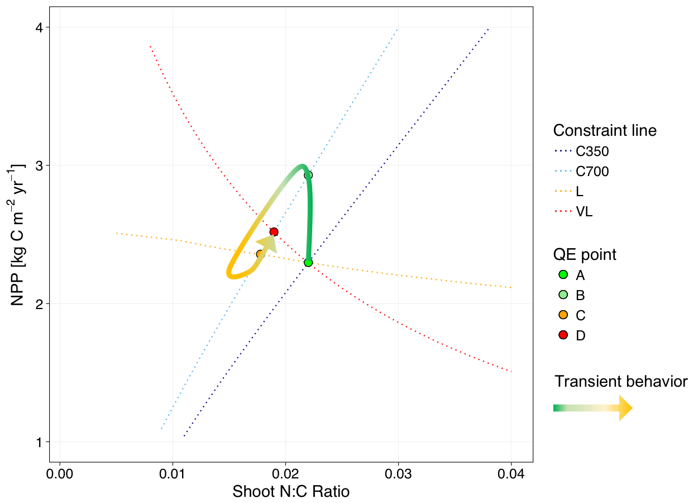

```{r setup, include=FALSE}
knitr::opts_chunk$set(echo = TRUE)
```

# 1. Introduction

This R markdown file introduces the Quasi-equilibrium (QE) framework baseline model. The basline QE model is a carbon-nitrogen (C-N) coupled model that is based on the Generic Decomposition And Yield (GDAY) model, originally developed by Comins and McMurtrie (1993).

The baseline model in this study compares the effect of wood NC stoichiometric flexiblity, with the 1st model has variable wood NC ratio and 2nd model has fixed wood NC ratio. 

Here we are evaluating the alternative assumption for wood stoichiometric flexiblity on plant's CO2 response. Time is also a factor considered here, with VL (very-long), L (long), and M (medium) terms considered as the final model equilibrium point, passive SOM pool equilibrated, passive and slow SOM pools equilibrated, respectively. 

<br/><br/>

# 2. Model structure

<p align="center">

</p>

The entire QE framework is built based on the model structure of the Generic Decomposition And Yield (G'DAY) model, as shown in the figure above. Boxes with dotted boundaries are the M term pools, box filled with diamonds is the L term pool. 

<br/><br/>

# 3. Procedures

Below I use step-by-step guidance to generate the results.

``` {r, message=FALSE}
    source("QE_Analyses/prepare_R.R")

```

Next, we run analytical run scripts to generate the pdf files and store the rest dataframes into data list:

``` {r, message = FALSE}
    source("QE_Analyses/Run_analytical_solutions.R")

```

Here I am preparing the necessary color and plot configurations. 

``` {r, message = FALSE, warning=FALSE}
    # library
    require(ggplot2)
    require(knitr)

    # two nice color palette for color blind
    # The palette with grey:
    cbPalette <- c("#999999", "#E69F00", "#56B4E9", "#009E73", "#F0E442", "#0072B2", "#D55E00", "#CC79A7")

    # The palette with black:
    cbbPalette <- c("#000000", "#E69F00", "#56B4E9", "#009E73", "#F0E442", "#0072B2", "#D55E00", "#CC79A7")
    
    save.plot <- F

```


Now, I am plotting the graphic illustration of the QE framework, based on Comins and McMurtrie's old approach.

``` {r, echo = FALSE, fig.width = 7, fig.align="center", message = FALSE, warning = FALSE, results="hide"}
    bDF <- mcm_model()

    ### split the data.list into two data frames
    cdf <- bDF$cDF
    edf <- bDF$eDF

    ### plot
    p<-ggplot() + 
        geom_line(data=cdf, aes(x=nc, y=P350, col="C350"), size=0.5, linetype="dotted")+   
        geom_line(data=cdf, aes(x=nc, y=VL, col="VL"), size=0.5, linetype="dotted") + 
        geom_line(data=cdf, aes(x=nc, y=L, col="L"), size=0.5, linetype="dotted") +  
        geom_line(data=cdf, aes(x=nc, y=M, col="M"), size=0.5, linetype="dotted") +            
        geom_line(data=cdf, aes(x=nc, y=P700, col="C700"), size=0.5, linetype="dotted") +     
        geom_point(data=edf, aes(x=nc_VL, y=NPP_VL, fill="A"), 
                color="black", shape=21, size=3) + 
        geom_point(data=edf, aes(x=nc_L_700, y=NPP_L_700, fill="D"), 
                   shape=21, color="black", size=3) +
        geom_point(data=edf, aes(x=nc_VL_700, y=NPP_VL_700, fill="E"), 
                   shape=21, color="black", size=3) +
        geom_point(data=edf, aes(x=nc_M_700, y=NPP_M_700, fill="C"), 
                   shape=21, color="black", size=3) +
        geom_point(data=edf, aes(x=nc_I, y=NPP_I, fill="B"), 
                   shape=21, color="black", size=3) +
        ylim(1.0, 4.0) + 
        xlim(0.001, 0.04) +
        labs(x="Shoot N:C Ratio", 
             y=expression(paste("NPP [kg C ", m^-2, " ", yr^-1, "]"))) +
        theme_linedraw() +
        theme(panel.grid.minor=element_blank(),
              axis.text=element_text(size=12),
              axis.title=element_text(size=14),
              legend.text=element_text(size=12),
              legend.title=element_text(size=14),
              panel.grid.major=element_line(color="grey")) +
        scale_colour_manual(name="Constraint line", 
                            values = c("C350" = "darkblue", "C700" = cbbPalette[3], "VL" = "red",
                                       "L" = "orange", "M" = "purple")) +
        scale_fill_manual(name="QE point", values = c("A" = "green", "B" = "lightgreen", "C" = "purple",
                                                      "D" = "orange", "E" = "red")) 
        ### only save this to pdf and then add arrows and recall it
        pdf("Plots/QE_illustration.pdf", width=8, height=6)
        plot(p)
        dev.off()

```

<p align="center">

</p>


<br/><br/>

Now, I am plotting QE framework for each individual model assumption.

### Run 1: Baseline N model with variable wood NC ratio
``` {r, echo = FALSE, fig.width = 7, fig.align="center", message = FALSE, warning = FALSE, results="hide"}
    ### split the data.list into two data frames
    cdf.r1 <- r1$cDF
    edf.r1 <- r1$eDF

    ### extract CO2 conc. from constraint DF
    cdf1.r1 <- cdf.r1[cdf.r1$CO2 == 350, ]
    cdf2.r1 <- cdf.r1[cdf.r1$CO2 == 700, ]

    ### extract CO2 conc. from eq DF
    edf1.r1 <- edf.r1[edf.r1$CO2 == 350, ]
    edf2.r1 <- edf.r1[edf.r1$CO2 == 700, ]
    ### plot
    p<-ggplot() + 
        geom_line(data=cdf1.r1, aes(x=nc, y=NPP_photo, col="C350"), size=0.5, linetype="dotted") +   
        geom_line(data=cdf1.r1, aes(x=nc, y=NPP_VL, col="VL"), size=0.5, linetype="dotted") + 
        geom_line(data=cdf1.r1, aes(x=nc, y=NPP_L, col="L"), size=0.5, linetype="dotted") +  
        geom_line(data=cdf1.r1, aes(x=nc, y=NPP_M, col="M"), size=0.5, linetype="dotted") +            
        geom_line(data=cdf2.r1, aes(x=nc, y=NPP_photo, col="C700"), size=0.5, linetype="dotted") +     
        geom_point(data=edf1.r1, aes(x=nc_VL, y=NPP_VL, fill="A"), 
                color="black", shape=21, size=3) + 
        geom_point(data=edf2.r1, aes(x=nc_L, y=NPP_L, fill="D"), 
                   shape=21, color="black", size=3) +
        geom_point(data=edf2.r1, aes(x=nc_M, y=NPP_M, fill="C"), 
                   shape=21, color="black", size=3) +
        geom_point(data=edf2.r1, aes(x=nc_VL, y=NPP_VL, fill="E"), 
                   shape=21, color="black", size=3) +
        geom_point(data=edf1.r1, aes(x=nc_VL, y=NPP_I, fill="B"), 
                   shape=21, color="black", size=3) +
        ylim(1.0, 2.0) + 
        xlim(0.001, 0.03) +
        labs(x="Shoot N:C Ratio", 
             y=expression(paste("NPP [kg C ", m^-2, " ", yr^-1, "]"))) +
        theme_linedraw() +
        theme(panel.grid.minor=element_blank(),
              axis.text=element_text(size=12),
              axis.title=element_text(size=14),
              legend.text=element_text(size=12),
              legend.title=element_text(size=14),
              panel.grid.major=element_line(color="grey")) +
        scale_colour_manual(name="Constraint line", 
                            values = c("C350" = "darkblue", "C700" = cbbPalette[3], "VL" = "red",
                                       "L" = "orange", "M" = "purple")) +
        scale_fill_manual(name="QE point", values = c("A" = "green", "B" = "lightgreen", "C" = "purple",
                                                      "D" = "orange", "E" = "red")) 

    plot(p)
    if (save.plot) {
        pdf("Plots/Run01.pdf", width=8, height=6)
        plot(p)
        dev.off()
    } 
```

Here, the QE framework indicates that, the VL and L line constraints are very much similar. 

<br/>
<br/>

### Run 2: Baseline N model with fixed wood NC ratio
```{r, echo=FALSE, fig.width = 7, fig.align="center", message = FALSE, warning = FALSE, results="hide"}

    ### split the data.list into two data frames
    cdf.r2 <- r2$cDF
    edf.r2 <- r2$eDF

    ### extract CO2 conc. from constraint DF
    cdf1.r2 <- cdf.r2[cdf.r2$CO2 == 350, ]
    cdf2.r2 <- cdf.r2[cdf.r2$CO2 == 700, ]
    
    ### extract CO2 conc. from eq DF
    edf1.r2 <- edf.r2[edf.r2$CO2 == 350, ]
    edf2.r2 <- edf.r2[edf.r2$CO2 == 700, ]
    
    ### plot
    p<-ggplot() + 
        geom_line(data=cdf1.r2, aes(x=nc, y=NPP_photo, col="C350"), size=0.5, linetype="dotted") +   
        geom_line(data=cdf1.r2, aes(x=nc, y=NPP_VL, col="VL"), size=0.5, linetype="dotted") + 
        geom_line(data=cdf1.r2, aes(x=nc, y=NPP_L, col="L"), size=0.5, linetype="dotted") +  
        geom_line(data=cdf1.r2, aes(x=nc, y=NPP_M, col="M"), size=0.5, linetype="dotted") +            
        geom_line(data=cdf2.r2, aes(x=nc, y=NPP_photo, col="C700"), size=0.5, linetype="dotted") +     
        geom_point(data=edf1.r2, aes(x=nc_VL, y=NPP_VL, fill="A"), 
                color="black", shape=21, size=3) + 
        geom_point(data=edf2.r2, aes(x=nc_L, y=NPP_L, fill="D"), 
                   shape=21, color="black", size=3) +
        geom_point(data=edf2.r2, aes(x=nc_M, y=NPP_M, fill="C"), 
                   shape=21, color="black", size=3) +
        geom_point(data=edf2.r2, aes(x=nc_VL, y=NPP_VL, fill="E"), 
                   shape=21, color="black", size=3) +
        geom_point(data=edf1.r2, aes(x=nc_VL, y=NPP_I, fill="B"), 
                   shape=21, color="black", size=3) +
        ylim(1.0, 2.0) + 
        xlim(0.001, 0.03) +
        labs(x="Shoot N:C Ratio", 
             y=expression(paste("NPP [kg C ", m^-2, " ", yr^-1, "]"))) +
        theme_linedraw() +
        theme(panel.grid.minor=element_blank(),
              axis.text=element_text(size=12),
              axis.title=element_text(size=14),
              legend.text=element_text(size=12),
              legend.title=element_text(size=14),
              panel.grid.major=element_line(color="grey")) +
        scale_colour_manual(name="Constraint line", 
                            values = c("C350" = "darkblue", "C700" = cbbPalette[3], "VL" = "red",
                                       "L" = "orange", "M" = "purple")) +
        scale_fill_manual(name="QE point", values = c("A" = "green", "B" = "lightgreen", "C" = "purple",
                                                      "D" = "orange", "E" = "red")) 
    plot(p)
    if (save.plot) {
        pdf("Plots/Run02.pdf", width=8, height=6)
        plot(p)
        dev.off()
    } 
```

Comparing variable (Run 1) and fixed (Run 2) wood NC ratio treatment, two key features emerge:

        - 1. The equilibrium points shift towards lower N:C ratio and NPP regions under fixed wood NC assumption.
        - 2. VL and L line are more separable under fixed wood NC assumption.

Variable wood stoichiometry means that there's less nutrient stored in the wood storage pool, hence more N is recycling at fast timescale for higher NPP production at higher N:C ratio (higher N:C means C is assimilated at higher N availability). 

Percent change in shoot N:C ratio and NPP at I, M, L and VL timepoints are summarized below:

``` {r, echo=FALSE}
    ### compute % change in NC and NPP under eCO2 condition
    chang1 <- (edf2.r1[,2:8] - edf1.r1[,2:8]) / edf1.r1[,2:8] * 100
    chang1$NPP_I <- (edf1.r1[,"NPP_I"] - edf1.r1[,"NPP_VL"]) / edf1.r1[,"NPP_VL"] * 100

    chang2 <- (edf2.r2[,2:8] - edf1.r2[,2:8]) / edf1.r2[,2:8] * 100
    chang2$NPP_I <- (edf1.r2[,"NPP_I"] - edf1.r2[,"NPP_VL"]) / edf1.r2[,"NPP_VL"] * 100
    
    ### organize the df for output
    changeDF <- round(rbind(chang1, chang2),1)
    changeDF[1,"Run"] <- "variable NC" 
    changeDF[2,"Run"] <- "fixed NC" 
    changeDF <- changeDF[,c("Run", "NPP_I", "NPP_M", "NPP_L", "NPP_VL", 
                            "nc_M", "nc_L", "nc_VL")]
    
    ### table output
    kable(changeDF, row.names=F, format = "markdown")

```

Comparing variable to fixed wood stoichiometric treatment, we have less CO2 fertilization effect at the I term but more CO2 fertilization effect at M, L and VL terms. NC ratios for M, L and VL terms decreased more under fixed than variable wood NC assumption. 

Under fixed wood NC scenario, more N is stored in woody pool at the M term, leaving less N available for M-term NPP, thus the significant less M term CO2 fertilization effect. 

<br/>
<br/>  

### Run 3: Explicit mineral N pool, variable wood NC ratio
``` {r, echo = FALSE, fig.width = 7, fig.align="center", message = FALSE, warning = FALSE, results="hide"}
    ### split the data.list into two data frames
    cdf.r3 <- r3$cDF
    edf.r3 <- r3$eDF

    ### extract CO2 conc. from constraint DF
    cdf1.r3 <- cdf.r3[cdf.r3$CO2 == 350, ]
    cdf2.r3 <- cdf.r3[cdf.r3$CO2 == 700, ]

    ### extract CO2 conc. from eq DF
    edf1.r3 <- edf.r3[edf.r3$CO2 == 350, ]
    edf2.r3 <- edf.r3[edf.r3$CO2 == 700, ]

    ### plot
    p<-ggplot() + 
        geom_line(data=cdf1.r3, aes(x=nc, y=NPP_photo, col="C350"), size=0.5, linetype="dotted") +   
        geom_line(data=cdf1.r3, aes(x=nc, y=NPP_VL, col="VL"), size=0.5, linetype="dotted") + 
        geom_line(data=cdf1.r3, aes(x=nc, y=NPP_L, col="L"), size=0.5, linetype="dotted") +  
        geom_line(data=cdf1.r3, aes(x=nc, y=NPP_M, col="M"), size=0.5, linetype="dotted") +            
        geom_line(data=cdf2.r3, aes(x=nc, y=NPP_photo, col="C700"), size=0.5, linetype="dotted") +     
        geom_point(data=edf1.r3, aes(x=nc_VL, y=NPP_VL, fill="A"), 
                color="black", shape=21, size=3) + 
        geom_point(data=edf2.r3, aes(x=nc_L, y=NPP_L, fill="D"), 
                   shape=21, color="black", size=3) +
        geom_point(data=edf2.r3, aes(x=nc_M, y=NPP_M, fill="C"), 
                   shape=21, color="black", size=3) +
        geom_point(data=edf2.r3, aes(x=nc_VL, y=NPP_VL, fill="E"), 
                   shape=21, color="black", size=3) +
        geom_point(data=edf1.r3, aes(x=nc_VL, y=NPP_I, fill="B"), 
                   shape=21, color="black", size=3) +
        ylim(1.0, 2.0) + 
        xlim(0.001, 0.03) +
        labs(x="Shoot N:C Ratio", 
             y=expression(paste("NPP [kg C ", m^-2, " ", yr^-1, "]"))) +
        theme_linedraw() +
        theme(panel.grid.minor=element_blank(),
              axis.text=element_text(size=12),
              axis.title=element_text(size=14),
              legend.text=element_text(size=12),
              legend.title=element_text(size=14),
              panel.grid.major=element_line(color="grey")) +
        scale_colour_manual(name="Constraint line", 
                            values = c("C350" = "darkblue", "C700" = cbbPalette[3], "VL" = "red",
                                       "L" = "orange", "M" = "purple")) +
        scale_fill_manual(name="QE point", values = c("A" = "green", "B" = "lightgreen", "C" = "purple",
                                                      "D" = "orange", "E" = "red")) 

    plot(p)
    if (save.plot) {
        pdf("Plots/Run03.pdf", width=8, height=6)
        plot(p)
        dev.off()
    } 
```

Given that N uptake rate is assumed to be 1, here this QE framework should be exactly the same as the Run 1 simulation (or at least be visually the same). Visually, there is minor difference comparing this graph to Run 1 graph, but I think this small difference can be neglected. 

<br/>
<br/>

### Run 4: Explicit mineral N pool, fixed wood NC ratio
``` {r, echo = FALSE, fig.width = 7, fig.align="center", message = FALSE, warning = FALSE, results="hide"}
    ### split the data.list into two data frames
    cdf.r4 <- r4$cDF
    edf.r4 <- r4$eDF

    ### extract CO2 conc. from constraint DF
    cdf1.r4 <- cdf.r4[cdf.r4$CO2 == 350, ]
    cdf2.r4 <- cdf.r4[cdf.r4$CO2 == 700, ]

    ### extract CO2 conc. from eq DF
    edf1.r4 <- edf.r4[edf.r4$CO2 == 350, ]
    edf2.r4 <- edf.r4[edf.r4$CO2 == 700, ]

    ### plot
    p<-ggplot() + 
        geom_line(data=cdf1.r4, aes(x=nc, y=NPP_photo, col="C350"), size=0.5, linetype="dotted") +   
        geom_line(data=cdf1.r4, aes(x=nc, y=NPP_VL, col="VL"), size=0.5, linetype="dotted") + 
        geom_line(data=cdf1.r4, aes(x=nc, y=NPP_L, col="L"), size=0.5, linetype="dotted") +  
        geom_line(data=cdf1.r4, aes(x=nc, y=NPP_M, col="M"), size=0.5, linetype="dotted") +            
        geom_line(data=cdf2.r4, aes(x=nc, y=NPP_photo, col="C700"), size=0.5, linetype="dotted") +     
        geom_point(data=edf1.r4, aes(x=nc_VL, y=NPP_VL, fill="A"), 
                color="black", shape=21, size=3) + 
        geom_point(data=edf2.r4, aes(x=nc_L, y=NPP_L, fill="D"), 
                   shape=21, color="black", size=3) +
        geom_point(data=edf2.r4, aes(x=nc_M, y=NPP_M, fill="C"), 
                   shape=21, color="black", size=3) +
        geom_point(data=edf2.r4, aes(x=nc_VL, y=NPP_VL, fill="E"), 
                   shape=21, color="black", size=3) +
        geom_point(data=edf1.r4, aes(x=nc_VL, y=NPP_I, fill="B"), 
                   shape=21, color="black", size=3) +
        ylim(1.0, 2.0) + 
        xlim(0.001, 0.03) +
        labs(x="Shoot N:C Ratio", 
             y=expression(paste("NPP [kg C ", m^-2, " ", yr^-1, "]"))) +
        theme_linedraw() +
        theme(panel.grid.minor=element_blank(),
              axis.text=element_text(size=12),
              axis.title=element_text(size=14),
              legend.text=element_text(size=12),
              legend.title=element_text(size=14),
              panel.grid.major=element_line(color="grey")) +
        scale_colour_manual(name="Constraint line", 
                            values = c("C350" = "darkblue", "C700" = cbbPalette[3], "VL" = "red",
                                       "L" = "orange", "M" = "purple")) +
        scale_fill_manual(name="QE point", values = c("A" = "green", "B" = "lightgreen", "C" = "purple",
                                                      "D" = "orange", "E" = "red")) 

    plot(p)
    if (save.plot) {
        pdf("Plots/Run04.pdf", width=8, height=6)
        plot(p)
        dev.off()
    } 
```

Given that N uptake rate is assumed to be 1, here this QE framework should be exactly the same as the Run 2 simulation (or at least be visually the same).

Here (run 3 and 4), minral N pool is made explicit. By modifying mineral N uptake rate, we should be able to see different QE points as the uptake of N will change. 

<br/>
<br/>

### Run 5: N uptake as a saturating function of root biomass, variable wood NC (GDAY approach)
``` {r, echo = FALSE, fig.width = 7, fig.align="center", message = FALSE, warning = FALSE, results="hide"}
    ### split the data.list into two data frames
    cdf.r5 <- r5$cDF
    edf.r5 <- r5$eDF

    ### extract CO2 conc. from constraint DF
    cdf1.r5 <- cdf.r5[cdf.r5$CO2 == 350, ]
    cdf2.r5 <- cdf.r5[cdf.r5$CO2 == 700, ]

    ### extract CO2 conc. from eq DF
    edf1.r5 <- edf.r5[edf.r5$CO2 == 350, ]
    edf2.r5 <- edf.r5[edf.r5$CO2 == 700, ]

    ### plot
    p<-ggplot() + 
        geom_line(data=cdf1.r5, aes(x=nc, y=NPP_photo, col="C350"), size=0.5, linetype="dotted") +   
        geom_line(data=cdf1.r5, aes(x=nc, y=NPP_VL, col="VL"), size=0.5, linetype="dotted") + 
        geom_line(data=cdf1.r5, aes(x=nc, y=NPP_L, col="L"), size=0.5, linetype="dotted") +  
        geom_line(data=cdf1.r5, aes(x=nc, y=NPP_M, col="M"), size=0.5, linetype="dotted") +            
        geom_line(data=cdf2.r5, aes(x=nc, y=NPP_photo, col="C700"), size=0.5, linetype="dotted") +     
        geom_point(data=edf1.r5, aes(x=nc_VL, y=NPP_VL, fill="A"), 
                color="black", shape=21, size=3) + 
        geom_point(data=edf2.r5, aes(x=nc_L, y=NPP_L, fill="D"), 
                   shape=21, color="black", size=3) +
        geom_point(data=edf2.r5, aes(x=nc_M, y=NPP_M, fill="C"), 
                   shape=21, color="black", size=3) +
        geom_point(data=edf2.r5, aes(x=nc_VL, y=NPP_VL, fill="E"), 
                   shape=21, color="black", size=3) +
        geom_point(data=edf1.r5, aes(x=nc_VL, y=NPP_I, fill="B"), 
                   shape=21, color="black", size=3) +
        ylim(1.0, 2.2) + 
        xlim(0.001, 0.03) +
        labs(x="Shoot N:C Ratio", 
             y=expression(paste("NPP [kg C ", m^-2, " ", yr^-1, "]"))) +
        theme_linedraw() +
        theme(panel.grid.minor=element_blank(),
              axis.text=element_text(size=12),
              axis.title=element_text(size=14),
              legend.text=element_text(size=12),
              legend.title=element_text(size=14),
              panel.grid.major=element_line(color="grey")) +
        scale_colour_manual(name="Constraint line", 
                            values = c("C350" = "darkblue", "C700" = cbbPalette[3], "VL" = "red",
                                       "L" = "orange", "M" = "purple")) +
        scale_fill_manual(name="QE point", values = c("A" = "green", "B" = "lightgreen", "C" = "purple",
                                                      "D" = "orange", "E" = "red")) 

    plot(p)
    if (save.plot) {
        pdf("Plots/Run05.pdf", width=8, height=6)
        plot(p)
        dev.off()
    } 
```

Here, uptake rate of N is represented mathematically as a saturating function of root biomass and linearly depend upon mineral N pool. We also assumed variable wood NC ratio to make it comparable to Run 1. 

<br/>
<br/>

### Run 6: N uptake as a saturating function of mineral N, variable wood NC ratio (O-CN approach)
``` {r, echo = FALSE, fig.width = 7, fig.align="center", message = FALSE, warning = FALSE, results="hide"}
    ### split the data.list into two data frames
    cdf.r6 <- r6$cDF
    edf.r6 <- r6$eDF

    ### extract CO2 conc. from constraint DF
    cdf1.r6 <- cdf.r6[cdf.r6$CO2 == 350, ]
    cdf2.r6 <- cdf.r6[cdf.r6$CO2 == 700, ]

    ### extract CO2 conc. from eq DF
    edf1.r6 <- edf.r6[edf.r6$CO2 == 350, ]
    edf2.r6 <- edf.r6[edf.r6$CO2 == 700, ]

    ### plot
    p<-ggplot() + 
        geom_line(data=cdf1.r6, aes(x=nc, y=NPP_photo, col="C350"), size=0.5, linetype="dotted") +   
        geom_line(data=cdf1.r6, aes(x=nc, y=NPP_L, col="L"), size=0.5, linetype="dotted") +  
        geom_line(data=cdf1.r6, aes(x=nc, y=NPP_M, col="M"), size=0.5, linetype="dotted") +            
        geom_line(data=cdf2.r6, aes(x=nc, y=NPP_photo, col="C700"), size=0.5, linetype="dotted") +     
        geom_point(data=edf1.r6, aes(x=nc_VL, y=NPP_VL, fill="A"), 
                   color="black", shape=21, size=3) + 
        geom_point(data=edf2.r6, aes(x=nc_L, y=NPP_L, fill="D"), 
                   shape=21, color="black", size=3) +
        geom_point(data=edf2.r6, aes(x=nc_M, y=NPP_M, fill="C"), 
                   shape=21, color="black", size=3) +
        geom_point(data=edf2.r6, aes(x=nc_VL, y=NPP_VL, fill="E"), 
                   shape=21, color="black", size=3) +
        geom_point(data=edf1.r6, aes(x=nc_VL, y=NPP_I, fill="B"), 
                   shape=21, color="black", size=1) +
        ylim(1.0, 2.2) + 
        xlim(0.001, 0.03) +
        labs(x="Shoot N:C Ratio", 
             y=expression(paste("NPP [kg C ", m^-2, " ", yr^-1, "]"))) +
        theme_linedraw() +
        theme(panel.grid.minor=element_blank(),
              axis.text=element_text(size=12),
              axis.title=element_text(size=14),
              legend.text=element_text(size=12),
              legend.title=element_text(size=14),
              panel.grid.major=element_line(color="grey")) +
        scale_colour_manual(name="Constraint line", 
                            values = c("C350" = "darkblue", "C700" = cbbPalette[3], 
                                       "L" = "orange", "M" = "purple")) +
        scale_fill_manual(name="QE point", values = c("A" = "green", "B" = "lightgreen", "C" = "purple",
                                                      "D" = "orange", "E" = "red")) 

    plot(p)
    if (save.plot) {
        pdf("Plots/Run06.pdf", width=8, height=6)
        plot(p)
        dev.off()
    } 
```

Here, mineral N uptake rate is a saturating function of mineral N pool and also linearly depend upon root biomass. The mathematical formular is similar to those represented in O-CN model.

There is no VL constraint curve because NPP cancels out for all possible leaf NC values (not shown here but it's in the equation). This means that, the VL-term CO2 fertilization effect is the same as the initial response, which means it is a full CO2 fertilization response. Over shorter timescales, we the NPP responses are similar, as the table below demonstrated. 

``` {r, echo=FALSE}
    ### compute % change in NC and NPP under eCO2 condition
    chang5 <- (edf2.r5[,2:8] - edf1.r5[,2:8]) / edf1.r5[,2:8] * 100
    chang5$NPP_I <- (edf1.r5[,"NPP_I"] - edf1.r5[,"NPP_VL"]) / edf1.r5[,"NPP_VL"] * 100

    chang6 <- (edf2.r6[,2:8] - edf1.r6[,2:8]) / edf1.r6[,2:8] * 100
    chang6$NPP_I <- (edf1.r6[,"NPP_I"] - edf1.r6[,"NPP_VL"]) / edf1.r6[,"NPP_VL"] * 100
    
    ### organize the df for output
    changeDF <- round(rbind(chang5, chang6),1)
    changeDF[1,"Run"] <- "GDAY" 
    changeDF[2,"Run"] <- "OCN" 
    changeDF <- changeDF[,c("Run", "NPP_I", "NPP_M", "NPP_L", "NPP_VL", 
                            "nc_M", "nc_L", "nc_VL")]
    
    ### table output
    kable(changeDF, row.names=F, format = "markdown")

```

<br/>
<br/>

### Run 7: Priming effect, fixed wood NC ratio
``` {r, echo = FALSE, fig.width = 7, fig.align="center", message = FALSE, warning = FALSE, results="hide"}
    ### split the data.list into two data frames
    cdf.r7 <- r7$cDF
    edf.r7 <- r7$eDF

    ### extract CO2 conc. from constraint DF
    cdf1.r7 <- cdf.r7[cdf.r7$CO2 == 350, ]
    cdf2.r7 <- cdf.r7[cdf.r7$CO2 == 700, ]

    ### extract CO2 conc. from eq DF
    edf1.r7 <- edf.r7[edf.r7$CO2 == 350, ]
    edf2.r7 <- edf.r7[edf.r7$CO2 == 700, ]

    ### plot
    p<-ggplot() + 
        geom_line(data=cdf1.r7, aes(x=nc, y=NPP_photo, col="C350"), size=0.5, linetype="dotted") +   
        geom_line(data=cdf1.r7, aes(x=nc, y=NPP_VL, col="VL"), size=0.5, linetype="dotted") + 
        geom_line(data=cdf1.r7, aes(x=nc, y=NPP_L, col="L"), size=0.5, linetype="dotted") +  
        geom_line(data=cdf1.r7, aes(x=nc, y=NPP_M, col="M"), size=0.5, linetype="dotted") +            
        geom_line(data=cdf2.r7, aes(x=nc, y=NPP_photo, col="C700"), size=0.5, linetype="dotted") +     
        geom_point(data=edf1.r7, aes(x=nc_VL, y=NPP_VL, fill="A"), 
                color="black", shape=21, size=3) + 
        geom_point(data=edf2.r7, aes(x=nc_L, y=NPP_L, fill="D"), 
                   shape=21, color="black", size=3) +
        geom_point(data=edf2.r7, aes(x=nc_M, y=NPP_M, fill="C"), 
                   shape=21, color="black", size=3) +
        geom_point(data=edf2.r7, aes(x=nc_VL, y=NPP_VL, fill="E"), 
                   shape=21, color="black", size=3) +
        geom_point(data=edf1.r7, aes(x=nc_VL, y=NPP_I, fill="B"), 
                   shape=21, color="black", size=3) +
        ylim(1.0, 2.0) + 
        xlim(0.001, 0.03) +
        labs(x="Shoot N:C Ratio", 
             y=expression(paste("NPP [kg C ", m^-2, " ", yr^-1, "]"))) +
        theme_linedraw() +
        theme(panel.grid.minor=element_blank(),
              axis.text=element_text(size=12),
              axis.title=element_text(size=14),
              legend.text=element_text(size=12),
              legend.title=element_text(size=14),
              panel.grid.major=element_line(color="grey")) +
        scale_colour_manual(name="Constraint line", 
                            values = c("C350" = "darkblue", "C700" = cbbPalette[3], "VL" = "red",
                                       "L" = "orange", "M" = "purple")) +
        scale_fill_manual(name="QE point", values = c("A" = "green", "B" = "lightgreen", "C" = "purple",
                                                      "D" = "orange", "E" = "red")) 
    plot(p)
    if (save.plot) {
        pdf("Plots/Run07.pdf", width=8, height=6)
        plot(p)
        dev.off()
    } 

```

Here we see that priming is not really doing a lot. The treatment for priming effect is that, we have certain C allocated to root exudated and help decomposition of slow SOM, hence more N is recycled back at the M term. 

<br/>
<br/>

### Run 8: Priming effect, variable wood NC ratio
``` {r, echo = FALSE, fig.width = 7, fig.align="center", message = FALSE, warning = FALSE, results="hide"}
    ### split the data.list into two data frames
    cdf.r8 <- r8$cDF
    edf.r8 <- r8$eDF

    ### extract CO2 conc. from constraint DF
    cdf1.r8 <- cdf.r8[cdf.r8$CO2 == 350, ]
    cdf2.r8 <- cdf.r8[cdf.r8$CO2 == 700, ]

    ### extract CO2 conc. from eq DF
    edf1.r8 <- edf.r8[edf.r8$CO2 == 350, ]
    edf2.r8 <- edf.r8[edf.r8$CO2 == 700, ]

    ### plot
    p<-ggplot() + 
        geom_line(data=cdf1.r8, aes(x=nc, y=NPP_photo, col="C350"), size=0.5, linetype="dotted") +   
        geom_line(data=cdf1.r8, aes(x=nc, y=NPP_VL, col="VL"), size=0.5, linetype="dotted") + 
        geom_line(data=cdf1.r8, aes(x=nc, y=NPP_L, col="L"), size=0.5, linetype="dotted") +  
        geom_line(data=cdf1.r8, aes(x=nc, y=NPP_M, col="M"), size=0.5, linetype="dotted") +            
        geom_line(data=cdf2.r8, aes(x=nc, y=NPP_photo, col="C700"), size=0.5, linetype="dotted") +     
        geom_point(data=edf1.r8, aes(x=nc_VL, y=NPP_VL, fill="A"), 
                color="black", shape=21, size=3) + 
        geom_point(data=edf2.r8, aes(x=nc_L, y=NPP_L, fill="D"), 
                   shape=21, color="black", size=3) +
        geom_point(data=edf2.r8, aes(x=nc_M, y=NPP_M, fill="C"), 
                   shape=21, color="black", size=3) +
        geom_point(data=edf2.r8, aes(x=nc_VL, y=NPP_VL, fill="E"), 
                   shape=21, color="black", size=3) +
        geom_point(data=edf1.r8, aes(x=nc_VL, y=NPP_I, fill="B"), 
                   shape=21, color="black", size=3) +
        ylim(1.0, 2.0) + 
        xlim(0.001, 0.03) +
        labs(x="Shoot N:C Ratio", 
             y=expression(paste("NPP [kg C ", m^-2, " ", yr^-1, "]"))) +
        theme_linedraw() +
        theme(panel.grid.minor=element_blank(),
              axis.text=element_text(size=12),
              axis.title=element_text(size=14),
              legend.text=element_text(size=12),
              legend.title=element_text(size=14),
              panel.grid.major=element_line(color="grey")) +
        scale_colour_manual(name="Constraint line", 
                            values = c("C350" = "darkblue", "C700" = cbbPalette[3], "VL" = "red",
                                       "L" = "orange", "M" = "purple")) +
        scale_fill_manual(name="QE point", values = c("A" = "green", "B" = "lightgreen", "C" = "purple",
                                                      "D" = "orange", "E" = "red")) 

    plot(p)
    if (save.plot) {
        pdf("Plots/Run08.pdf", width=8, height=6)
        plot(p)
        dev.off()
    } 
```

Under variable wood NC assumption, we see that the M, L and VL line overlap with each other. This means that, the slow pool decomposion is hugely stimulated by root exudates, making this as large a pool as the passive N release pool. Previously (under variable wood NC but without priming effect) the combination of slow SOM and wood pools should be very small, because little N is stored in wood pool and the decomposition of slow SOM is not as fast as the decomposition of slow SOM stimualted by root exudates. 

``` {r, echo=FALSE}
    ### compute % change in NC and NPP under eCO2 condition
    chang7 <- (edf2.r7[,2:8] - edf1.r7[,2:8]) / edf1.r7[,2:8] * 100
    chang7$NPP_I <- (edf1.r7[,"NPP_I"] - edf1.r7[,"NPP_VL"]) / edf1.r7[,"NPP_VL"] * 100

    chang8 <- (edf2.r8[,2:8] - edf1.r8[,2:8]) / edf1.r8[,2:8] * 100
    chang8$NPP_I <- (edf1.r8[,"NPP_I"] - edf1.r8[,"NPP_VL"]) / edf1.r8[,"NPP_VL"] * 100
    
    ### organize the df for output
    changeDF <- round(rbind(chang2, chang1, chang7, chang8),1)
    changeDF[1,"Run"] <- "Baseline, fixed NC" 
    changeDF[2,"Run"] <- "Baseline, variable NC" 
    changeDF[3,"Run"] <- "Priming, fixed NC" 
    changeDF[4,"Run"] <- "Priming, variable NC" 
    changeDF <- changeDF[,c("Run", "NPP_I", "NPP_M", "NPP_L", "NPP_VL", 
                            "nc_M", "nc_L", "nc_VL")]
    
    ### table output
    kable(changeDF, row.names=F, format = "markdown")

```

Comparing the CO2 effect across models (baseline vs. priming effect), we see that priming effect only stimulated little extra M term NPP under eCO2 as compared to the baseline model, under fixed wood NC assumption. However, the fixed model comparison tells a completely different story. M term response hugely differ, with priming stimulated an almost double M-term NPP response to eCO2 as compared to the baseline model. 

<br/>
<br/>


### Run 9: CLM potential NPP, Fixed wood N:C ratio

CLM has a potential NPP approach, with the following set of equations:
$$P_{dem} = NPP_{pot}n_p $$

where *P<sub>dem</sub>* is the plant N demand, and *n<sub>p</sub>* is the plant N:C ratio.

The immobilization N demand is calculated as (*I<sub>dem</sub>*):
$$ I_{dem} = fC_{lit}t_{lit}(n_s - n_p)$$

where *f* is the fraction of litter C becomes soil C, *C<sub>lit</sub>* is the total litter C, *t<sub>lit</sub>* is the turnover time of the litter pool, and *<sub>ns</sub>* is the soil NC ratio. *C<sub>lit</sub>* can also be expressed as:
$$C_{lit} = NPP_{pot}/t_{lit} $$


Actual plant uptake is expressed as:
$$P_{act} = min(N_{min}P_{dem}/(I_{dem} + P_{dem}), P_{dem}) $$

and actually immobilisation is expressed as:
$$I_{act} = min(N_{min}I_{dem}/(I_{dem} + P_{dem}), I_{dem}) $$

Actual NPP is expressed as:
$$NPP_{act} = NPP_{pot}P_{act}/P_{dem}$$

Now, for VL-term constraint, we have
$$N_{in} = N_{loss} = l_nN_{min}$$

Under potential NPP, we can calculate NPP by re-arranging the equations, as:
$$NPP = N_{in} / [l_n/(1-l_n)n_p] $$

For an actual NPP, we need to consider immobilization demand, expressed as:
$$N_{min} = l_nN_{min} + P_{act} + I_{act} = l_nN_{min} + NPP_{act}n_p + NPP_{act}f(n_s-n_p) $$

Re-arrange, we get:

$$NPP_{act} = N_{in}(1-l_n) / ln[n_p + f(n_s-n_p)] $$

Similar equations can be derived for L and M term constraints. 

Visionally, with potential NPP and actual NPP, we have the QE framework looks like this:

``` {r, echo = FALSE, fig.width = 7, fig.align="center", message = FALSE, warning = FALSE, results="hide"}
    ### split the data.list into two data frames
    cdf.r9 <- r9$cDF
    edf.r9 <- r9$eDF

    ### extract CO2 conc. from constraint DF
    cdf1.r9 <- cdf.r9[cdf.r9$CO2 == 350, ]
    cdf2.r9 <- cdf.r9[cdf.r9$CO2 == 700, ]

    ### extract CO2 conc. from eq DF
    edf1.r9 <- edf.r9[edf.r9$CO2 == 350, ]
    edf2.r9 <- edf.r9[edf.r9$CO2 == 700, ]

    ### plot
    p<-ggplot() + 
        geom_line(data=cdf1.r9, aes(x=nc, y=NPP_photo, col="C350"), size=0.5, linetype="dotted") +   
        geom_line(data=cdf1.r9, aes(x=nc, y=NPP_VL, col="VL"), size=0.5, linetype="dotted") + 
        geom_line(data=cdf1.r9, aes(x=nc, y=NPP_L, col="L"), size=0.5, linetype="dotted") +  
        geom_line(data=cdf1.r9, aes(x=nc, y=NPP_M, col="M"), size=0.5, linetype="dotted") +            
        geom_line(data=cdf2.r9, aes(x=nc, y=NPP_photo, col="C700"), size=0.5, linetype="dotted") +     
        geom_point(data=edf1.r9, aes(x=nc_pot_VL, y=NPP_pot_VL), 
                color="green", shape=21, size=3) + 
        geom_point(data=edf2.r9, aes(x=nc_pot_L, y=NPP_pot_L), 
                   shape=21, color="orange", size=3) +
        geom_point(data=edf2.r9, aes(x=nc_pot_M, y=NPP_pot_M), 
                   shape=21, color="purple", size=3) +
        geom_point(data=edf2.r9, aes(x=nc_pot_VL, y=NPP_pot_VL), 
                   shape=21, color="red", size=3) +
        geom_point(data=edf1.r9, aes(x=nc_pot_VL, y=NPP_I, fill="B"), 
                   shape=21, color="black", size=3) +
        geom_point(data=edf1.r9, aes(x=nc_act_VL, y=NPP_act_VL, fill="A"), 
                color="black", shape=21, size=3) + 
        geom_point(data=edf2.r9, aes(x=nc_act_L, y=NPP_act_L, fill="D"), 
                   shape=21, color="black", size=3) +
        geom_point(data=edf2.r9, aes(x=nc_act_M, y=NPP_act_M, fill="C"), 
                   shape=21, color="black", size=3) +
        geom_point(data=edf2.r9, aes(x=nc_act_VL, y=NPP_act_VL, fill="E"), 
                   shape=21, color="black", size=3) +
        ylim(0.5, 2.0) + 
        xlim(0.001, 0.03) +
        labs(x="Shoot N:C Ratio", 
             y=expression(paste("NPP [kg C ", m^-2, " ", yr^-1, "]"))) +
        theme_linedraw() +
        theme(panel.grid.minor=element_blank(),
              axis.text=element_text(size=12),
              axis.title=element_text(size=14),
              legend.text=element_text(size=12),
              legend.title=element_text(size=14),
              panel.grid.major=element_line(color="grey")) +
        scale_colour_manual(name="Constraint line", 
                            values = c("C350" = "darkblue", "C700" = cbbPalette[3], "VL" = "red",
                                       "L" = "orange", "M" = "purple")) +
        scale_fill_manual(name="QE point", values = c("A" = "green", "B" = "lightgreen", "C" = "purple",
                                                      "D" = "orange", "E" = "red")) 

    plot(p)
    if (save.plot) {
        pdf("Plots/Run09.pdf", width=8, height=6)
        plot(p)
        dev.off()
    } 
```

The unfilled dots are the potential equilibrated NPP, whereas the filled dots are the actually equilibrated NPP at various timesteps. 

Here we can see that, at equilibrium, the actual NPP is not intersecting with the photosynthetic constraint line, and is much lower than the potential NPP, due to the N immobilization demand. We have effectively removed actual NPP dependence on potential NPP. 


### Run 10: CLM potential NPP, variable wood N:C ratio
``` {r, echo = FALSE, fig.width = 7, fig.align="center", message = FALSE, warning = FALSE, results="hide"}
    ### split the data.list into two data frames
    cdf.r10 <- r10$cDF
    edf.r10 <- r10$eDF

    ### extract CO2 conc. from constraint DF
    cdf1.r10 <- cdf.r10[cdf.r10$CO2 == 350, ]
    cdf2.r10 <- cdf.r10[cdf.r10$CO2 == 700, ]

    ### extract CO2 conc. from eq DF
    edf1.r10 <- edf.r10[edf.r10$CO2 == 350, ]
    edf2.r10 <- edf.r10[edf.r10$CO2 == 700, ]

    ### plot
    p<-ggplot() + 
        geom_line(data=cdf1.r10, aes(x=nc, y=NPP_photo, col="C350"), size=0.5, linetype="dotted") +   
        geom_line(data=cdf1.r10, aes(x=nc, y=NPP_VL, col="VL"), size=0.5, linetype="dotted") + 
        geom_line(data=cdf1.r10, aes(x=nc, y=NPP_L, col="L"), size=0.5, linetype="dotted") +  
        geom_line(data=cdf1.r10, aes(x=nc, y=NPP_M, col="M"), size=0.5, linetype="dotted") +            
        geom_line(data=cdf2.r10, aes(x=nc, y=NPP_photo, col="C700"), size=0.5, linetype="dotted") +     
        geom_point(data=edf1.r10, aes(x=nc_pot_VL, y=NPP_pot_VL), 
                color="green", shape=21, size=3) + 
        geom_point(data=edf2.r10, aes(x=nc_pot_L, y=NPP_pot_L), 
                   shape=21, color="orange", size=3) +
        geom_point(data=edf2.r10, aes(x=nc_pot_M, y=NPP_pot_M), 
                   shape=21, color="purple", size=3) +
        geom_point(data=edf2.r10, aes(x=nc_pot_VL, y=NPP_pot_VL), 
                   shape=21, color="red", size=3) +
        geom_point(data=edf1.r10, aes(x=nc_pot_VL, y=NPP_I, fill="B"), 
                   shape=21, color="black", size=3) +
        geom_point(data=edf1.r10, aes(x=nc_act_VL, y=NPP_act_VL, fill="A"), 
                color="black", shape=21, size=3) + 
        geom_point(data=edf2.r10, aes(x=nc_act_L, y=NPP_act_L, fill="D"), 
                   shape=21, color="black", size=3) +
        geom_point(data=edf2.r10, aes(x=nc_act_M, y=NPP_act_M, fill="C"), 
                   shape=21, color="black", size=3) +
        geom_point(data=edf2.r10, aes(x=nc_act_VL, y=NPP_act_VL, fill="E"), 
                   shape=21, color="black", size=3) +
        ylim(0.5, 2.0) + 
        xlim(0.001, 0.03) +
        labs(x="Shoot N:C Ratio", 
             y=expression(paste("NPP [kg C ", m^-2, " ", yr^-1, "]"))) +
        theme_linedraw() +
        theme(panel.grid.minor=element_blank(),
              axis.text=element_text(size=12),
              axis.title=element_text(size=14),
              legend.text=element_text(size=12),
              legend.title=element_text(size=14),
              panel.grid.major=element_line(color="grey")) +
        scale_colour_manual(name="Constraint line", 
                            values = c("C350" = "darkblue", "C700" = cbbPalette[3], "VL" = "red",
                                       "L" = "orange", "M" = "purple")) +
        scale_fill_manual(name="QE point", values = c("A" = "green", "B" = "lightgreen", "C" = "purple",
                                                      "D" = "orange", "E" = "red")) 

    plot(p)
    if (save.plot) {
        pdf("Plots/Run10.pdf", width=8, height=6)
        plot(p)
        dev.off()
    } 
```

<br/><br/>

### CLM N uptake 

Based on equations from Ghimire et al. (2016), CLM representation of N uptake is the same as O-CN. So here I can ignore the testing of this function.

<br/><br/>

### Run 11. CLM model C cost of N uptake, fixed wood N:C ratio
This treatment is based on Fisher et al. (2010) and Shi et al. (2015).

There are 4 pathways through which N is absorbed:

    - Diffusion - as part of advection
    - Retranslocation
    - Active uptake
    - BNF

Retranslocation or resorption requires C to synthesize the enzymes and regulatory elements that degrade and remobilize leaf nutrients, and to drive the translocation stream in which the nutrients are suspended. 

Active uptake is an ion-specific enzyme-catalyzed process analogous to Michaelis-Menten kinetics. Energy demand for ion uptake can consume a substantial amount of total respiratory C to move N against concentration gradients. 

BNF is performed by bacteria living in symbiosis within root modules on certain types of plants.

Here, I am calculating C cost of N uptake based on retranslocation, active uptake and fixation. 

``` {r, echo = FALSE, fig.width = 7, fig.align="center", message = FALSE, warning = FALSE, results="hide"}
    ### split the data.list into two data frames
    cdf.r11 <- r11$cDF
    edf.r11 <- r11$eDF

    ### extract CO2 conc. from constraint DF
    cdf1.r11 <- cdf.r11[cdf.r11$CO2 == 350, ]
    cdf2.r11 <- cdf.r11[cdf.r11$CO2 == 700, ]

    ### extract CO2 conc. from eq DF
    edf1.r11 <- edf.r11[edf.r11$CO2 == 350, ]
    edf2.r11 <- edf.r11[edf.r11$CO2 == 700, ]

    ### plot
    p<-ggplot() + 
        geom_line(data=cdf1.r11, aes(x=nc, y=NPP_photo, col="C350"), size=0.5, linetype="dotted") +   
        geom_line(data=cdf1.r11, aes(x=nc, y=NPP_VL, col="VL"), size=0.5, linetype="dotted") + 
        geom_line(data=cdf1.r11, aes(x=nc, y=NPP_L, col="L"), size=0.5, linetype="dotted") +  
        geom_line(data=cdf1.r11, aes(x=nc, y=NPP_M, col="M"), size=0.5, linetype="dotted") +            
        geom_line(data=cdf2.r11, aes(x=nc, y=NPP_photo, col="C700"), size=0.5, linetype="dotted") +     
        geom_point(data=edf1.r11, aes(x=nc_pot_VL, y=NPP_pot_VL), 
                color="green", shape=21, size=3) + 
        geom_point(data=edf2.r11, aes(x=nc_pot_L, y=NPP_pot_L), 
                   shape=21, color="orange", size=3) +
        geom_point(data=edf2.r11, aes(x=nc_pot_M, y=NPP_pot_M), 
                   shape=21, color="purple", size=3) +
        geom_point(data=edf2.r11, aes(x=nc_pot_VL, y=NPP_pot_VL), 
                   shape=21, color="red", size=3) +
        geom_point(data=edf1.r11, aes(x=nc_pot_VL, y=NPP_I, fill="B"), 
                   shape=21, color="black", size=3) +
        geom_point(data=edf1.r11, aes(x=nc_pot_VL, y=NPP_act_VL, fill="A"), 
                color="black", shape=21, size=3) + 
        geom_point(data=edf2.r11, aes(x=nc_pot_L, y=NPP_act_L, fill="D"), 
                   shape=21, color="black", size=3) +
        geom_point(data=edf2.r11, aes(x=nc_pot_M, y=NPP_act_M, fill="C"), 
                   shape=21, color="black", size=3) +
        geom_point(data=edf2.r11, aes(x=nc_pot_VL, y=NPP_act_VL, fill="E"), 
                   shape=21, color="black", size=3) +
        ylim(0.0, 2.0) + 
        xlim(0.001, 0.03) +
        labs(x="Shoot N:C Ratio", 
             y=expression(paste("NPP [kg C ", m^-2, " ", yr^-1, "]"))) +
        theme_linedraw() +
        theme(panel.grid.minor=element_blank(),
              axis.text=element_text(size=12),
              axis.title=element_text(size=14),
              legend.text=element_text(size=12),
              legend.title=element_text(size=14),
              panel.grid.major=element_line(color="grey")) +
        scale_colour_manual(name="Constraint line", 
                            values = c("C350" = "darkblue", "C700" = cbbPalette[3], "VL" = "red",
                                       "L" = "orange", "M" = "purple")) +
        scale_fill_manual(name="QE point", values = c("A" = "green", "B" = "lightgreen", "C" = "purple",
                                                      "D" = "orange", "E" = "red")) 

    plot(p)
    if (save.plot) {
        pdf("Plots/Run11.pdf", width=8, height=6)
        plot(p)
        dev.off()
    } 
```


<br/><br/>

### Run 12. CLM model C cost of N uptake, variable wood N:C ratio
``` {r, echo = FALSE, fig.width = 7, fig.align="center", message = FALSE, warning = FALSE, results="hide"}
    ### split the data.list into two data frames
    cdf.r12 <- r12$cDF
    edf.r12 <- r12$eDF

    ### extract CO2 conc. from constraint DF
    cdf1.r12 <- cdf.r12[cdf.r12$CO2 == 350, ]
    cdf2.r12 <- cdf.r12[cdf.r12$CO2 == 700, ]

    ### extract CO2 conc. from eq DF
    edf1.r12 <- edf.r12[edf.r12$CO2 == 350, ]
    edf2.r12 <- edf.r12[edf.r12$CO2 == 700, ]

    ### plot
    p<-ggplot() + 
        geom_line(data=cdf1.r12, aes(x=nc, y=NPP_photo, col="C350"), size=0.5, linetype="dotted") +   
        geom_line(data=cdf1.r12, aes(x=nc, y=NPP_VL, col="VL"), size=0.5, linetype="dotted") + 
        geom_line(data=cdf1.r12, aes(x=nc, y=NPP_L, col="L"), size=0.5, linetype="dotted") +  
        geom_line(data=cdf1.r12, aes(x=nc, y=NPP_M, col="M"), size=0.5, linetype="dotted") +            
        geom_line(data=cdf2.r12, aes(x=nc, y=NPP_photo, col="C700"), size=0.5, linetype="dotted") +     
        geom_point(data=edf1.r12, aes(x=nc_pot_VL, y=NPP_pot_VL), 
                color="green", shape=21, size=3) + 
        geom_point(data=edf2.r12, aes(x=nc_pot_L, y=NPP_pot_L), 
                   shape=21, color="orange", size=3) +
        geom_point(data=edf2.r12, aes(x=nc_pot_M, y=NPP_pot_M), 
                   shape=21, color="purple", size=3) +
        geom_point(data=edf2.r12, aes(x=nc_pot_VL, y=NPP_pot_VL), 
                   shape=21, color="red", size=3) +
        geom_point(data=edf1.r12, aes(x=nc_pot_VL, y=NPP_I, fill="B"), 
                   shape=21, color="black", size=3) +
        geom_point(data=edf1.r12, aes(x=nc_pot_VL, y=NPP_act_VL, fill="A"), 
                color="black", shape=21, size=3) + 
        geom_point(data=edf2.r12, aes(x=nc_pot_L, y=NPP_act_L, fill="D"), 
                   shape=21, color="black", size=3) +
        geom_point(data=edf2.r12, aes(x=nc_pot_M, y=NPP_act_M, fill="C"), 
                   shape=21, color="black", size=3) +
        geom_point(data=edf2.r12, aes(x=nc_pot_VL, y=NPP_act_VL, fill="E"), 
                   shape=21, color="black", size=3) +
        ylim(0.0, 2.0) + 
        xlim(0.001, 0.03) +
        labs(x="Shoot N:C Ratio", 
             y=expression(paste("NPP [kg C ", m^-2, " ", yr^-1, "]"))) +
        theme_linedraw() +
        theme(panel.grid.minor=element_blank(),
              axis.text=element_text(size=12),
              axis.title=element_text(size=14),
              legend.text=element_text(size=12),
              legend.title=element_text(size=14),
              panel.grid.major=element_line(color="grey")) +
        scale_colour_manual(name="Constraint line", 
                            values = c("C350" = "darkblue", "C700" = cbbPalette[3], "VL" = "red",
                                       "L" = "orange", "M" = "purple")) +
        scale_fill_manual(name="QE point", values = c("A" = "green", "B" = "lightgreen", "C" = "purple",
                                                      "D" = "orange", "E" = "red")) 

    plot(p)
    if (save.plot) {
        pdf("Plots/Run12.pdf", width=8, height=6)
        plot(p)
        dev.off()
    } 
```

# 4. Summary table:
``` {r, echo=FALSE}
    source("QE_Analyses/make_summary_table.R")
    sumDF <- make_summary_table(destDir = "Tables")
    
    ### table output
    kable(sumDF, row.names=F, format = "markdown")

```


# 5. To-do list:
Below is a continuous update of the to-do list of this project:

    - Check parameter sensitivity for priming effect.
    - Check parameter sensitivity for f and ns in CLM baseline approach.
    - Check parameter sensitivity for n uptake coefficient, and graphically demonstrate its effect
    - Spell out all equations
    - Look at relationships beyond NPP and leaf NC
    - Add GDAY simulations (time series result)

<br/>
<br/>

